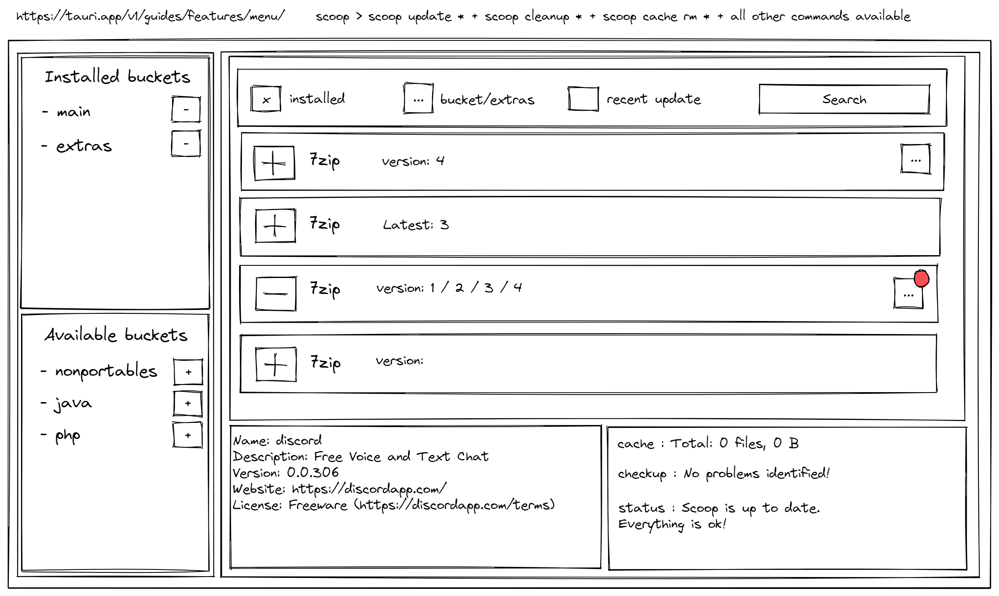

# Scoop-GUI

An tauri gui for [scoop](https://scoop.sh)

## Installation

```bash
git clone https://github.com/OzakIOne/scoop-gui

cd scoop-gui

pnpm i -r

pnpm run build
```

## How it shoud look



## Api

[Insomnia workspace](./docs/insomnia/scoop-gui-insomnia.json)

## Todo

[tsconfig references](https://youtu.be/HM03XGVlRXI)
