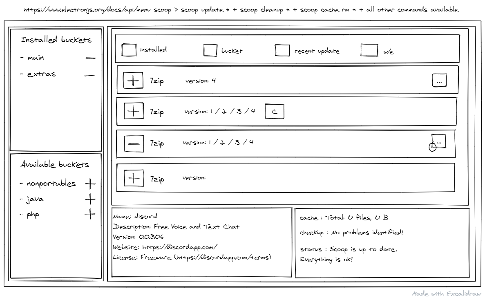

# scoop-gui

An electron gui for [scoop](https://scoop.sh) (windows package manager)

## Installation

```bash
git clone https://github.com/OzakIOne/scoop-gui

cd scoop-gui

npm install

npm run fastify

npm run dev #run in another shell
```

> For now the is a very early phase of the app, only the ui is available, nothings else works

## How it shoud look


